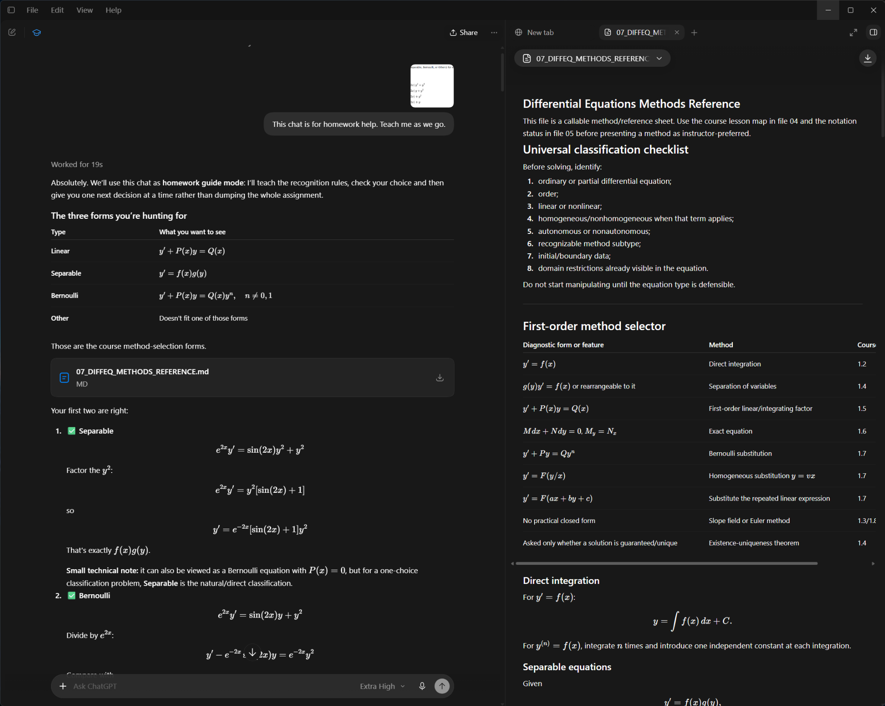

# MATH 3400 Instructor Review

Interactive lesson materials for Dr. Meredith Casey’s review of course alignment,
mathematical explanations and instructional design.

## Open the review

**[View interactive lessons](https://mpollard33.github.io/math3400-instructor-review/)**

Open the website and select a lesson from the review menu. No download or sign-in is required.

### Download a copy

[Download the ZIP](https://github.com/mpollard33/math3400-instructor-review/archive/refs/heads/main.zip) to review the materials locally.

Download and extract the folder, then open **[index.html](index.html)** in a browser.
The lesson studios are self-contained HTML files. JavaScript enables their navigation
and graphs. No account, package installation or build step is required.

For local HTTP viewing, run this command from the repository root and open
`http://localhost:8000`:

```sh
python3 -m http.server 8000
```

## Lessons

| Lesson | Studio |
|---|---|
| 1.1–1.3 | [Introduction, integration and slope fields](https://mpollard33.github.io/math3400-instructor-review/lessons/Lessons_1_1_to_1_3_Instructor_Review.html) |
| 1.4 | [Separable equations and applications](https://mpollard33.github.io/math3400-instructor-review/lessons/Lesson_1_4_Instructor_Review.html) |
| 1.5 | [First-order linear equations](https://mpollard33.github.io/math3400-instructor-review/lessons/Lesson_1_5_Instructor_Review.html) |
| 1.6 | [Exact equations](https://mpollard33.github.io/math3400-instructor-review/lessons/Lesson_1_6_Instructor_Review.html) |
| 1.7 | [Substitution methods: Parts A and B](https://mpollard33.github.io/math3400-instructor-review/lessons/Lesson_1_7_Instructor_Review.html) |
| 1.8 | [Euler’s method](https://mpollard33.github.io/math3400-instructor-review/lessons/Lesson_1_8_Instructor_Review.html) |

Lessons 1.1–1.3 remain combined. Each of Lessons 1.4 through 1.8 has its own file;
Lesson 1.7 includes both Parts A and B.

## Homework-helper example

The [example screenshot](examples/homework-helper.png) shows a homework-help conversation
next to a methods reference. See [the example notes](examples/README.md) for the intended
interaction pattern. The image is a static illustration, not a separate functioning assistant.



## Repository layout

| Location | Contents |
|---|---|
| `index.html` | Clickable review landing page |
| `lessons/` | The six selected Instructor Review exports |
| `examples/` | Supplied homework-helper screenshot and explanatory notes |
| `docs/` | Scope, source caveats and provenance |
| `manifest.json` | Selected chat titles, lesson paths and content hashes |
| `CHECKSUMS.sha256` | Integrity hashes for all other package files |
| `tools/check_bundle.py` | Standard-library integrity and local-link checker |

## Repository checks

Use this folder’s contents as the repository root, preserving the directory structure.
The website uses relative lesson and image links; the README links directly to the live lessons. The package contains no repository credentials,
private chat links or machine-specific paths. The repository contains the instructor review distribution.

To check the extracted bundle:

```sh
python3 tools/check_bundle.py
```

## Scope

This package contains the saved lesson outputs from the selected Instructor Review chats.
It does not contain complete chat transcripts. Earlier tutoring chats, the separate
Lesson 1.4 consistency-check draft and the earlier configuration-only ZIP are excluded.
Original instructor PDFs are not bundled.

See [review notes](docs/REVIEW_NOTES.md) for source-version caveats and the checks actually
performed. Review materials are not presented as an instructor-approved course edition.

---

<sub>Project design and instructional direction: Marcus Pollard. [Source and development credits](docs/PROVENANCE.md).</sub>
